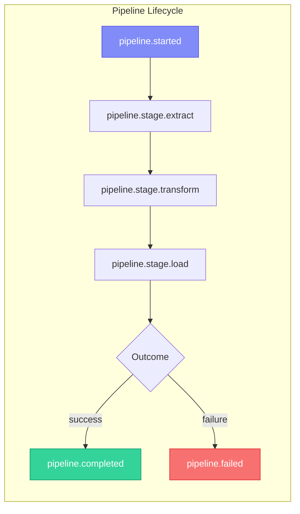

# Events API

Acme emits events at every stage of pipeline execution. Use the Events API to subscribe to events, build custom dashboards, or integrate with external monitoring systems.

## Event types



| Event                      | Fired when                      |
| -------------------------- | ------------------------------- |
| `pipeline.started`         | A pipeline run begins           |
| `pipeline.stage.extract`   | Extraction completes            |
| `pipeline.stage.transform` | All transforms complete         |
| `pipeline.stage.load`      | Loading completes               |
| `pipeline.completed`       | Run finishes successfully       |
| `pipeline.failed`          | Run fails with an error         |
| `pipeline.retrying`        | A failed step is being retried  |
| `connector.health.changed` | Connector health status changes |
| `scheduler.triggered`      | Scheduler triggers a pipeline   |

## Event payload

Every event has a consistent structure:

```json
{
  "id": "evt_abc123",
  "type": "pipeline.completed",
  "timestamp": "2026-02-15T06:00:04.7Z",
  "pipeline": "user-analytics",
  "run_id": "run_001",
  "data": {
    "status": "success",
    "duration_ms": 4700,
    "rows_extracted": 1247,
    "rows_loaded": 892,
    "stages": [
      { "name": "extract", "duration_ms": 1200, "rows": 1247 },
      { "name": "filter", "duration_ms": 300, "rows": 892 },
      { "name": "transform", "duration_ms": 1800, "rows": 892 },
      { "name": "load", "duration_ms": 1400, "rows": 892 }
    ]
  }
}
```

## Subscribing to events

### Webhooks

Receive events via HTTP POST:

```yaml
# acme.yml
events:
  webhooks:
    - url: https://your-app.com/webhooks/acme
      events: ["pipeline.completed", "pipeline.failed"]
      secret: ${WEBHOOK_SECRET}
      retry: true
```

Acme signs webhook payloads with HMAC-SHA256:

```python
import hmac
import hashlib

def verify_webhook(payload, signature, secret):
    expected = hmac.new(
        secret.encode(),
        payload.encode(),
        hashlib.sha256
    ).hexdigest()
    return hmac.compare_digest(f"sha256={expected}", signature)
```

### Server-Sent Events (SSE)

Stream events in real-time:

```bash
curl -N -H "Authorization: Bearer df_key_..." \
  "https://acme.example.com/api/v1/events/stream?pipeline=user-analytics"
```

```
event: pipeline.started
data: {"pipeline":"user-analytics","run_id":"run_002","timestamp":"2026-02-15T12:00:00Z"}

event: pipeline.stage.extract
data: {"pipeline":"user-analytics","rows":1300,"duration_ms":1100}

event: pipeline.completed
data: {"pipeline":"user-analytics","rows_loaded":950,"duration_ms":4200}
```

### SDK usage

```python
# Subscribe to events
@client.events.on("pipeline.completed")
def on_complete(event):
    print(f"Pipeline {event.pipeline} completed: {event.data['rows_loaded']} rows")

@client.events.on("pipeline.failed")
def on_failure(event):
    print(f"Pipeline {event.pipeline} FAILED: {event.data['error']}")
    # Send alert to PagerDuty, Slack, etc.

# Start listening
client.events.listen()
```

### Polling

If webhooks and SSE aren't an option, poll for events:

```
GET /api/v1/events?since=2026-02-15T06:00:00Z&pipeline=user-analytics
```

> [!tip] Prefer SSE or webhooks
> Polling introduces latency and is less efficient. Use SSE for real-time dashboards and webhooks for automated workflows.

## Filtering events

```bash
# All events for a specific pipeline
GET /api/v1/events?pipeline=user-analytics

# Only failure events
GET /api/v1/events?type=pipeline.failed

# Events in a time range
GET /api/v1/events?since=2026-02-15T00:00:00Z&until=2026-02-16T00:00:00Z
```

## Related

- [[guides/monitoring|Monitoring]] — using events for dashboards and alerts
- [[guides/error-handling|Error Handling]] — subscribing to failure events
- [[api-reference/pipeline|Pipeline API]] — pipeline run details
