# Pipeline API

The Pipeline API lets you manage pipeline definitions, trigger runs, and inspect results programmatically.

## Endpoints

### List pipelines

```
GET /api/v1/pipelines
```

**Parameters:**

| Parameter  | Type    | Description                                   |
| ---------- | ------- | --------------------------------------------- |
| `status`   | string  | Filter by status: `active`, `paused`, `error` |
| `page`     | integer | Page number (default: 1)                      |
| `per_page` | integer | Results per page (default: 20, max: 100)      |

**Response:**

```json
{
  "data": [
    {
      "name": "user-analytics",
      "version": "1.0",
      "status": "active",
      "schedule": "0 */6 * * *",
      "last_run": {
        "id": "run_001",
        "status": "success",
        "started_at": "2026-02-15T06:00:00Z",
        "duration_ms": 4700,
        "rows_loaded": 892
      },
      "next_run_at": "2026-02-15T12:00:00Z"
    }
  ],
  "meta": {
    "total": 12,
    "page": 1,
    "per_page": 20
  }
}
```

### Get pipeline details

```
GET /api/v1/pipelines/:name
```

### Create pipeline

```
POST /api/v1/pipelines
```

**Request body:**

```json
{
  "name": "new-pipeline",
  "version": "1.0",
  "sources": [...],
  "transforms": [...],
  "destinations": [...]
}
```

> [!note]
> You can also create pipelines by pushing YAML files. The API accepts both JSON and YAML formats.

### Update pipeline

```
PUT /api/v1/pipelines/:name
```

### Delete pipeline

```
DELETE /api/v1/pipelines/:name
```

> [!danger] Destructive action
> Deleting a pipeline removes its definition and all run history. This action cannot be undone.

### Trigger a run

```
POST /api/v1/pipelines/:name/runs
```

**Parameters:**

| Parameter      | Type    | Description                                   |
| -------------- | ------- | --------------------------------------------- |
| `full_refresh` | boolean | Ignore incremental state and process all data |
| `dry_run`      | boolean | Validate without executing                    |
| `variables`    | object  | Override environment variables for this run   |

**Example:**

```bash
curl -X POST \
  -H "Authorization: Bearer df_key_..." \
  -H "Content-Type: application/json" \
  -d '{"full_refresh": false}' \
  https://acme.example.com/api/v1/pipelines/user-analytics/runs
```

**Response:**

```json
{
  "data": {
    "id": "run_002",
    "pipeline": "user-analytics",
    "status": "running",
    "started_at": "2026-02-15T10:30:00Z",
    "progress": {
      "stage": "extract",
      "rows_processed": 0
    }
  }
}
```

### Get run details

```
GET /api/v1/pipelines/:name/runs/:run_id
```

### List run history

```
GET /api/v1/pipelines/:name/runs
```



```mermaid
gantt
    title Pipeline Run History (Last 24h)
    dateFormat HH:mm
    axisFormat %H:%M

    section user-analytics
    Run 1 (success)    :done, 00:00, 5m
    Run 2 (success)    :done, 06:00, 4m
    Run 3 (success)    :done, 12:00, 5m
    Run 4 (running)    :active, 18:00, 3m

    section order-sync
    Run 1 (success)    :done, 00:00, 12m
    Run 2 (failed)     :crit, 06:00, 2m
    Run 3 (success)    :done, 12:00, 11m
```

## SDK usage

```python
# List all pipelines
pipelines = client.pipelines.list()

# Get a specific pipeline
pipeline = client.pipelines.get("user-analytics")

# Trigger a run
run = client.pipelines.run("user-analytics", full_refresh=True)

# Wait for completion
result = run.wait(timeout=300)

# Get run history
runs = client.pipelines.runs("user-analytics", limit=10)
```

## Related

- [[api-reference/client|Client API]] — initialization and authentication
- [[api-reference/scheduler|Scheduler API]] — schedule management
- [[api-reference/events|Events API]] — pipeline event subscriptions
