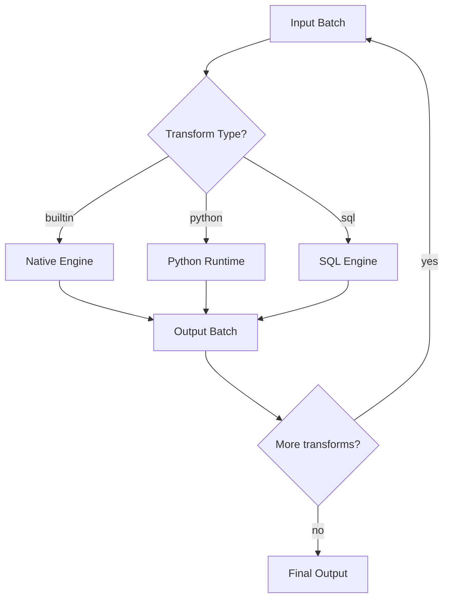

# Transform API

The Transform API lets you register, manage, and inspect transform functions programmatically.

## Endpoints

### List registered transforms

```
GET /api/v1/transforms
```

**Response:**

```json
{
  "data": [
    {
      "name": "filter",
      "type": "builtin",
      "description": "Remove rows that don't match a condition"
    },
    {
      "name": "transforms.clean.normalize_phone",
      "type": "python",
      "description": "Normalize phone numbers to E.164 format",
      "source": "transforms/clean.py"
    }
  ]
}
```

### Register a custom transform

```
POST /api/v1/transforms
```

```json
{
  "name": "my_transform",
  "type": "python",
  "source_code": "def my_transform(row):\n    row['processed'] = True\n    return row",
  "description": "Mark rows as processed"
}
```

### Test a transform

```
POST /api/v1/transforms/:name/test
```

```json
{
  "input": [
    { "name": "Alice", "age": 28 },
    { "name": "Bob", "age": 16 }
  ],
  "config": {
    "condition": "age >= 18"
  }
}
```

**Response:**

```json
{
  "data": {
    "output": [{ "name": "Alice", "age": 28 }],
    "stats": {
      "input_rows": 2,
      "output_rows": 1,
      "duration_ms": 2
    }
  }
}
```

## SDK usage

### Applying transforms programmatically

```python
from acme.sdk import Transform

# Built-in transform
filter_transform = Transform.filter(condition="status = 'active'")

# Map transform
map_transform = Transform.map(fields={
    "full_name": "first_name || ' ' || last_name",
    "year": "EXTRACT(YEAR FROM created_at)",
})

# Chain transforms
pipeline_transforms = [
    filter_transform,
    map_transform,
    Transform.select(columns=["id", "full_name", "year"]),
]

# Apply to data
data = [
    {"id": 1, "first_name": "Alice", "last_name": "Johnson", "status": "active", "created_at": "2025-01-15"},
    {"id": 2, "first_name": "Bob", "last_name": "Smith", "status": "inactive", "created_at": "2024-06-01"},
]

result = Transform.apply_chain(pipeline_transforms, data)
# [{"id": 1, "full_name": "Alice Johnson", "year": 2025}]
```

## Transform execution model



> [!note] Performance
> Built-in transforms run in the native engine and are significantly faster than Python transforms. Use built-in transforms when possible and reserve Python for complex logic.

## Related

- [[concepts/transforms|Transform Concepts]] — built-in transforms reference
- [[guides/custom-transforms|Writing Custom Transforms]] — Python transform guide
- [[api-reference/pipeline|Pipeline API]] — using transforms in pipelines
