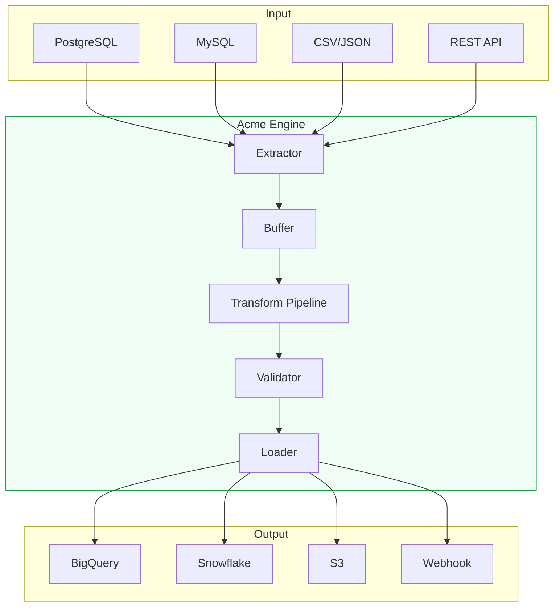
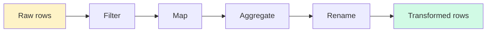
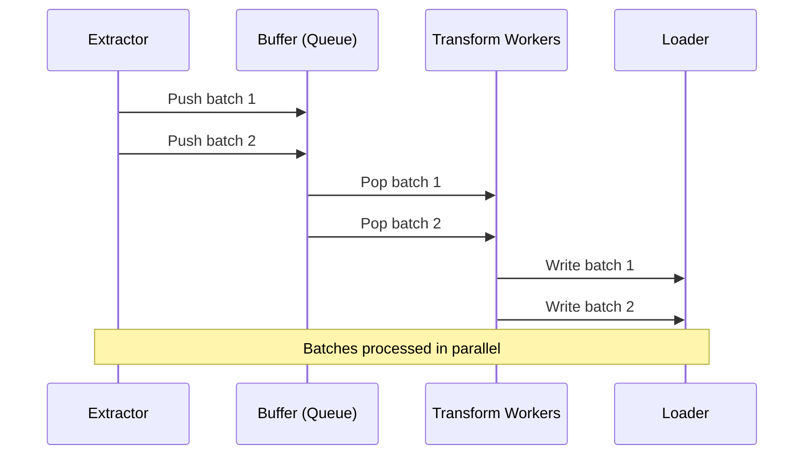

# Architecture

Acme is designed as a lightweight, embeddable pipeline engine. This page explains how data moves through the system and what happens at each stage.

## High-level overview



## Processing stages

### 1. Extraction

The extractor connects to the configured source and pulls data. For databases, this means executing the configured query. For file sources, it reads and parses the file.

> [!info] Incremental extraction
> By default, Acme tracks the last successful run time and passes it as `:last_run` to your source query. This means you only process new and updated rows.

```yaml
sources:
  - type: postgres
    query: "SELECT * FROM orders WHERE updated_at > :last_run"
```

### 2. Buffering

Extracted rows are buffered in memory in configurable batch sizes. This controls memory usage and allows for batch-level retries.

```yaml
defaults:
  batch_size: 5000 # rows per batch
  buffer_memory: 256mb # max memory for buffering
```

### 3. Transform pipeline

Each batch passes through the configured transforms in order. Transforms are composable — the output of one is the input of the next.



See [[concepts/transforms|Transforms]] for available transform types.

### 4. Validation

Before loading, rows pass through optional schema validation:

```yaml
schema:
  user_id: { type: integer, required: true }
  email: { type: string, format: email }
  age: { type: integer, min: 0, max: 150 }
```

Rows that fail validation are logged and optionally sent to a dead-letter queue.

### 5. Loading

The loader writes batches to the configured destination. Write modes include:

| Mode      | Behavior                               |
| --------- | -------------------------------------- |
| `append`  | Always insert new rows                 |
| `replace` | Drop and recreate the table            |
| `upsert`  | Insert or update based on a key column |
| `merge`   | Advanced merge with custom logic       |

## Concurrency model

Acme uses a producer-consumer model:



By default, Acme uses 4 transform workers. This can be configured:

```yaml
defaults:
  workers: 8
```

> [!warning] Worker count and memory
> More workers means higher throughput but also higher memory usage. Each worker buffers one full batch in memory. With `batch_size: 5000` and `workers: 8`, you may need up to 400MB of RAM depending on row size.

## State management

Pipeline state is stored locally in `.acme/runs/`. Each run creates a JSON metadata file:

```json
{
  "pipeline": "user-analytics",
  "run_id": "run_2026_02_15_001",
  "started_at": "2026-02-15T06:00:00Z",
  "completed_at": "2026-02-15T06:00:04.7Z",
  "status": "success",
  "rows_extracted": 1247,
  "rows_loaded": 892,
  "duration_ms": 4700
}
```

## Related pages

- [[concepts/pipelines|Pipelines]] — pipeline configuration and lifecycle
- [[concepts/connectors|Connectors]] — available source and destination connectors
- [[concepts/transforms|Transforms]] — built-in and custom transform functions
