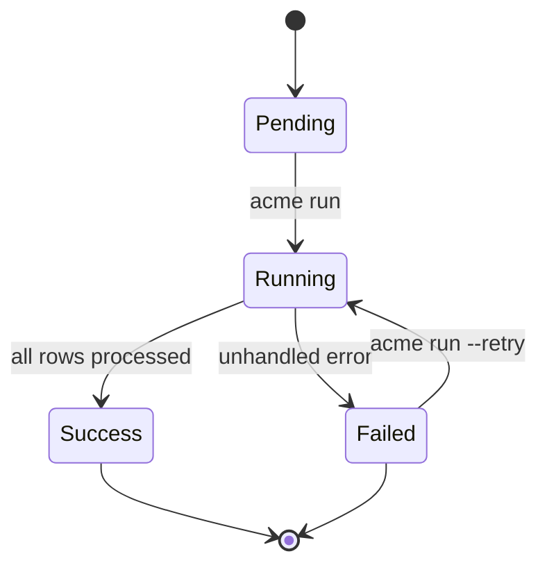
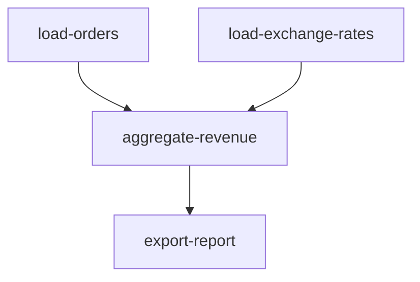

# Pipelines

A pipeline is the core unit of work in Acme. It defines where data comes from, how it's transformed, and where it goes.

## Pipeline lifecycle



## Anatomy of a pipeline

Every pipeline has three required sections:

```yaml
name: my-pipeline
version: "1.0"

# 1. Where does the data come from?
sources:
  - type: postgres
    name: main_db
    connection: ${DATABASE_URL}
    query: "SELECT * FROM events"

# 2. How should the data be transformed?
transforms:
  - type: filter
    condition: "event_type = 'purchase'"
  - type: map
    fields:
      revenue_usd: "amount * exchange_rate"

# 3. Where should the data go?
destinations:
  - type: bigquery
    dataset: analytics
    table: purchases
```

## Scheduling

Pipelines can be scheduled using cron expressions:

```yaml
schedule: "0 */6 * * *"   # Every 6 hours
schedule: "0 2 * * *"     # Daily at 2 AM
schedule: "*/5 * * * *"   # Every 5 minutes
```

Or triggered by events:

```yaml
trigger:
  type: webhook
  path: /api/trigger/my-pipeline
```

See the [[api-reference/scheduler|Scheduler API]] for programmatic scheduling.

## Pipeline dependencies

Pipelines can depend on other pipelines:

```yaml
name: aggregate-revenue
depends_on:
  - load-orders
  - load-exchange-rates
```



Acme ensures that `aggregate-revenue` only runs after both dependencies have completed successfully.

> [!warning] Circular dependencies
> Acme will detect and reject circular dependencies at validation time. If you see a `CircularDependencyError`, check your `depends_on` fields.

## Error handling

By default, a pipeline fails on the first error. You can configure retry behavior:

```yaml
error_handling:
  strategy: retry # retry | skip | fail
  max_retries: 3
  retry_delay: 30s
  dead_letter:
    type: json
    path: ./errors/failed_rows.json
```

See [[guides/error-handling|Error Handling Guide]] for detailed strategies.

## Multiple destinations

A single pipeline can write to multiple destinations:

```yaml
destinations:
  - type: bigquery
    dataset: analytics
    table: events
  - type: s3
    bucket: my-data-lake
    prefix: events/
    format: parquet
```

Both destinations receive the same transformed data.

## Related

- [[concepts/connectors|Connectors]] — available data sources and destinations
- [[concepts/transforms|Transforms]] — data transformation options
- [[guides/testing-pipelines|Testing Pipelines]] — validate before deploying
