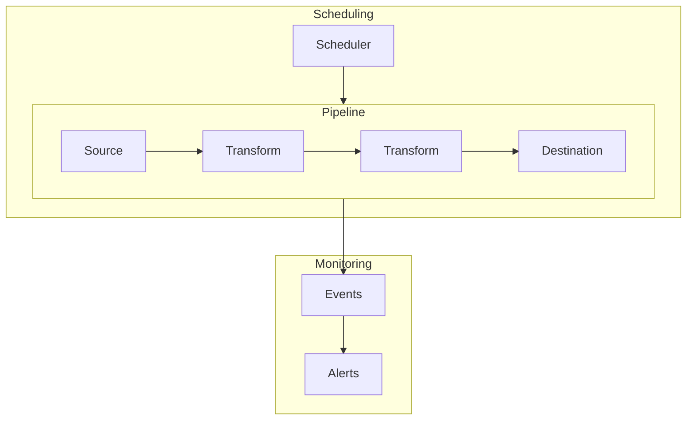

# Core Concepts

Before diving into advanced usage, it's helpful to understand the building blocks of Acme.

## Key abstractions

| Concept       | Description                                               | Learn more                                 |
| ------------- | --------------------------------------------------------- | ------------------------------------------ |
| **Pipeline**  | A complete data workflow: extract → transform → load      | [[concepts/pipelines\|Pipelines]]          |
| **Connector** | A source or destination adapter (PostgreSQL, S3, etc.)    | [[concepts/connectors\|Connectors]]        |
| **Transform** | A data manipulation step (filter, map, aggregate, custom) | [[concepts/transforms\|Transforms]]        |
| **Scheduler** | Controls when and how often pipelines run                 | [[api-reference/scheduler\|Scheduler API]] |
| **Event**     | Metadata emitted during pipeline execution                | [[api-reference/events\|Events API]]       |

## Design principles

Acme is built around a few core beliefs:

1. **Configuration over code** — Most pipelines don't need custom code. YAML should be enough for 80% of use cases.
2. **Incremental by default** — Pipelines track their last run and only process new data.
3. **Fail loudly** — When something breaks, you should know immediately. See [[guides/error-handling|Error Handling]].
4. **Testable** — Every pipeline can be tested locally before deployment. See [[guides/testing-pipelines|Testing]].

> [!abstract] Architecture deep dive
> For a complete overview of how Acme processes data internally, see [[concepts/architecture|Architecture]].
