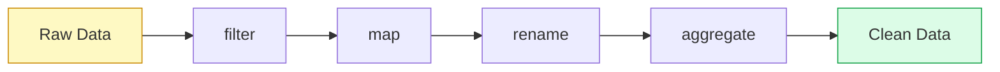

# Transforms

Transforms are the processing steps that shape your data between extraction and loading. Acme includes a set of built-in transforms and supports custom functions in Python.

## Transform pipeline

Transforms are applied in order. Each transform receives rows from the previous step and outputs rows to the next.



## Built-in transforms

### filter

Remove rows that don't match a condition.

```yaml
- type: filter
  condition: "status = 'active' AND age >= 18"
```

### map

Compute new fields from existing ones.

```yaml
- type: map
  fields:
    full_name: "first_name || ' ' || last_name"
    year: "EXTRACT(YEAR FROM created_at)"
    is_premium: "plan IN ('pro', 'enterprise')"
```

### rename

Rename columns.

```yaml
- type: rename
  columns:
    email_address: email
    phone_number: phone
```

### select

Choose which columns to keep.

```yaml
- type: select
  columns: [id, name, email, created_at]
```

### aggregate

Group and aggregate rows.

```yaml
- type: aggregate
  group_by: [country, plan]
  metrics:
    total_users: "COUNT(*)"
    avg_age: "AVG(age)"
    total_revenue: "SUM(monthly_spend)"
```

### deduplicate

Remove duplicate rows.

```yaml
- type: deduplicate
  key: [email]
  keep: latest # latest | earliest | first
```

### sort

Order rows by one or more fields.

```yaml
- type: sort
  by: created_at
  order: desc
```

## Custom transforms (Python)

For logic that can't be expressed in YAML, write a Python function:

```python
# transforms/enrich.py
import requests

GEOCODING_API = "https://api.example.com/geocode"

def add_coordinates(row):
    """Look up latitude/longitude from a city name."""
    city = row.get("city")
    if city:
        resp = requests.get(GEOCODING_API, params={"q": city})
        data = resp.json()
        row["latitude"] = data.get("lat")
        row["longitude"] = data.get("lng")
    return row
```

Use it in your pipeline:

```yaml
- type: python
  function: transforms.enrich.add_coordinates
```

> [!warning] Performance consideration
> Custom Python transforms that make HTTP calls will significantly slow down your pipeline. Consider using batch transforms or caching results. See [[guides/error-handling|Error Handling]] for retry strategies.

## Chaining transforms

Transforms compose naturally:

```yaml
transforms:
  # Step 1: Keep only active users
  - type: filter
    condition: "status = 'active'"

  # Step 2: Normalize emails
  - type: python
    function: transforms.normalize.lowercase_email

  # Step 3: Compute derived fields
  - type: map
    fields:
      signup_year: "EXTRACT(YEAR FROM created_at)"
      full_name: "first_name || ' ' || last_name"

  # Step 4: Pick output columns
  - type: select
    columns: [id, full_name, email, signup_year]
```

> [!example] Real-world example
> See [[getting-started/first-pipeline|Your First Pipeline]] for a complete example with custom transforms.

## Related

- [[concepts/pipelines|Pipelines]] — how transforms fit into the pipeline lifecycle
- [[api-reference/transform|Transform API]] — programmatic transform creation
- [[guides/testing-pipelines|Testing Pipelines]] — test transforms with fixture data
