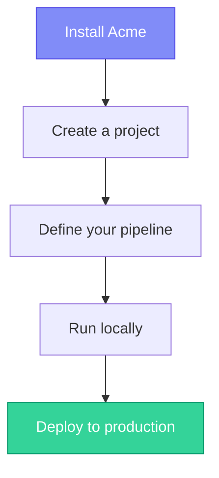

# Getting Started

Get up and running with Acme in minutes. This section walks you through everything from installation to deploying your first pipeline.

## Steps

1. **[[getting-started/installation|Installation]]** — Install the CLI and set up your environment
2. **[[getting-started/quickstart|Quickstart]]** — Build a working pipeline in 5 minutes
3. **[[getting-started/project-structure|Project Structure]]** — Understand how a Acme project is organized
4. **[[getting-started/first-pipeline|Your First Pipeline]]** — A deeper walkthrough of pipeline concepts

> [!tip] Already familiar with ETL tools?
> Skip ahead to the [[concepts/architecture|Architecture]] overview for a high-level comparison.

## System requirements

| Requirement | Minimum      | Recommended |
| ----------- | ------------ | ----------- |
| Python      | 3.10+        | 3.12+       |
| Memory      | 512 MB       | 2 GB        |
| Disk        | 100 MB       | 1 GB        |
| OS          | Linux, macOS | Linux       |
