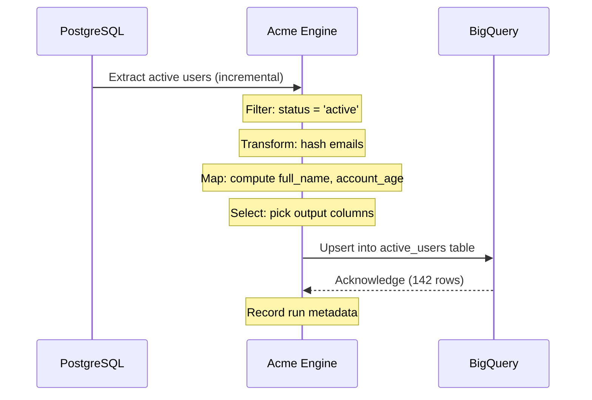

# Your First Pipeline

This guide walks you through building a real-world pipeline that reads from a PostgreSQL database, transforms the data, and loads it into a data warehouse.

> [!info] Prerequisites
>
> - Acme CLI installed ([[getting-started/installation|Installation]])
> - A PostgreSQL database with sample data
> - A BigQuery project (or use the local JSON destination for testing)

## The scenario

You have a `users` table in PostgreSQL and need to:

1. Extract active users
2. Anonymize email addresses
3. Calculate account age
4. Load the results into BigQuery

## Pipeline definition

```yaml
# pipelines/user-analytics.yml
name: user-analytics
schedule: "0 */6 * * *" # Every 6 hours

sources:
  - type: postgres
    name: users_db
    connection: ${DATABASE_URL}
    query: |
      SELECT
        id,
        email,
        first_name,
        last_name,
        status,
        created_at,
        last_login_at
      FROM users
      WHERE updated_at > :last_run

transforms:
  - type: filter
    condition: "status = 'active'"

  - type: python
    function: transforms.anonymize.hash_email

  - type: map
    fields:
      full_name: "first_name || ' ' || last_name"
      account_age_days: "DATEDIFF('day', created_at, NOW())"
      is_recent: "last_login_at > NOW() - INTERVAL '30 days'"

  - type: select
    columns:
      - id
      - full_name
      - email_hash
      - account_age_days
      - is_recent
      - created_at

destinations:
  - type: bigquery
    dataset: analytics
    table: active_users
    write_mode: upsert
    key: id
```

## Custom transform

Create a Python function to anonymize emails:

```python
# transforms/anonymize.py
import hashlib

def hash_email(row):
    """Replace email with a SHA-256 hash for privacy."""
    email = row.get("email", "")
    row["email_hash"] = hashlib.sha256(email.encode()).hexdigest()[:16]
    del row["email"]
    return row
```

## Data flow visualization



## Running the pipeline

```bash
# Dry run — validate without executing
acme run pipelines/user-analytics.yml --dry-run

# Run once
acme run pipelines/user-analytics.yml

# Run with verbose logging
acme run pipelines/user-analytics.yml --verbose
```

Expected output:

```
✓ Loaded pipeline: user-analytics v1.0
✓ Source: users_db (1,247 rows)
✓ Transform: filter (892 rows passed)
✓ Transform: python/hash_email (892 rows)
✓ Transform: map (3 fields computed)
✓ Transform: select (6 columns)
✓ Destination: bigquery/active_users (892 rows upserted)

Pipeline completed in 4.7s
```

> [!success] Pipeline running!
> Your data is now flowing from PostgreSQL to BigQuery every 6 hours. Check the [[guides/monitoring|Monitoring Guide]] to set up alerts.

## Troubleshooting

| Problem                        | Solution                                                          |
| ------------------------------ | ----------------------------------------------------------------- |
| `ConnectionRefused`            | Check that your database is running and `DATABASE_URL` is correct |
| `PermissionDenied` on BigQuery | Ensure your service account has `bigquery.dataEditor` role        |
| Slow initial run               | Add an index on `updated_at` in your source table                 |
| Transform errors               | Run with `--verbose` to see the failing row                       |

## Next steps

- [[concepts/pipelines|Pipeline Concepts]] — understand scheduling, dependencies, and error handling
- [[guides/connecting-databases|Connecting Databases]] — set up different database sources
- [[guides/deployment|Deployment]] — run pipelines in production
