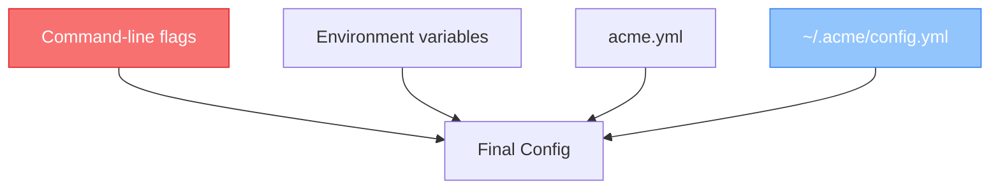

# Configuration

Acme is configured through a combination of YAML files and environment variables. This section covers all available settings.

## Configuration sources

Acme reads configuration from these sources, in order of precedence (highest first):

1. **Command-line flags** — override everything (`--batch-size 1000`)
2. **Environment variables** — per-environment settings (`ACME_BATCH_SIZE=1000`)
3. **Project config** — `acme.yml` in the project root
4. **User config** — `~/.acme/config.yml` for machine-wide defaults

## Guides

- [[configuration/config-file|Configuration File Reference]] — complete `acme.yml` reference
- [[configuration/environment-variables|Environment Variables]] — managing secrets and per-environment settings

> [!tip] Getting started?
> For most projects, the defaults work well. Start with a minimal `acme.yml` and add settings as needed.
