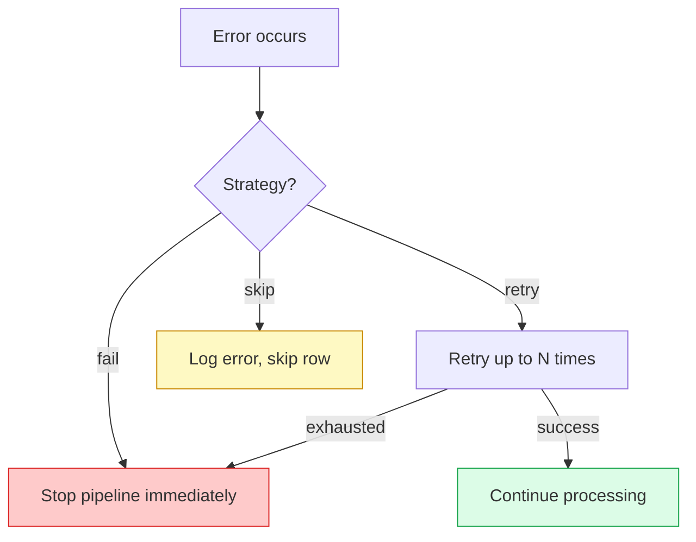

# Error Handling

Things break. Databases go down, APIs return errors, and data doesn't always match your expectations. This guide covers how Acme handles failures and how to configure resilient pipelines.

## Error strategies

Acme supports three error strategies:



### `fail` (default)

The pipeline stops immediately on the first error. Best for pipelines where data integrity is critical.

```yaml
error_handling:
  strategy: fail
```

### `retry`

Retry the failed operation up to N times with configurable backoff.

```yaml
error_handling:
  strategy: retry
  max_retries: 3
  retry_delay: 10s
  backoff: exponential # linear | exponential | constant
```

> [!info] Exponential backoff
> With exponential backoff and a base delay of 10s, retries happen at: 10s, 20s, 40s. This helps when the downstream system is temporarily overloaded.

### `skip`

Skip the failing row and continue processing. Failed rows are logged and optionally sent to a dead-letter queue.

```yaml
error_handling:
  strategy: skip
  max_errors: 100 # stop after 100 errors in a single run
  dead_letter:
    type: json
    path: ./errors/${pipeline_name}_${run_id}.json
```

## Dead-letter queues

When using the `skip` strategy, failed rows can be captured for later inspection:

```yaml
error_handling:
  strategy: skip
  dead_letter:
    type: json
    path: ./errors/

    # Or send to a database
    # type: postgres
    # connection: ${ERROR_DB_URL}
    # table: pipeline_errors
```

Each failed row is stored with metadata:

```json
{
  "row": { "id": 42, "email": "bad-data", "age": "not_a_number" },
  "error": "ValueError: invalid literal for int(): 'not_a_number'",
  "pipeline": "user-analytics",
  "transform": "map",
  "timestamp": "2026-02-15T06:12:34Z"
}
```

> [!tip] Reprocessing failed rows
> You can use a dead-letter JSON file as a source for a recovery pipeline:
>
> ```yaml
> sources:
>   - type: json
>     path: ./errors/user-analytics_run_001.json
> ```

## Notifications

Get alerted when pipelines fail:

```yaml
notifications:
  on_failure:
    - type: slack
      webhook: ${SLACK_WEBHOOK}
      channel: "#data-alerts"
    - type: email
      to: team@example.com
  on_success:
    - type: slack
      webhook: ${SLACK_WEBHOOK}
      channel: "#data-logs"
      # Only notify on the first success after a failure
      only_after_failure: true
```

## Common errors and solutions

| Error                   | Cause                             | Solution                                            |
| ----------------------- | --------------------------------- | --------------------------------------------------- |
| `ConnectionRefused`     | Database is down or unreachable   | Check host/port, firewall rules, SSL config         |
| `AuthenticationFailed`  | Invalid credentials               | Verify `${DATABASE_URL}`, check user permissions    |
| `SchemaValidationError` | Row doesn't match expected schema | Check source data, add a `filter` before validation |
| `RateLimitExceeded`     | API destination is throttling     | Reduce `batch_size`, add `retry` with backoff       |
| `OutOfMemory`           | Batch too large for available RAM | Reduce `batch_size` or `workers`                    |

> [!warning]
> The `skip` strategy can silently drop data if misconfigured. Always set a `max_errors` limit and monitor your dead-letter queue.

## Related

- [[guides/monitoring|Monitoring]] — set up dashboards for error rates
- [[concepts/pipelines|Pipelines]] — pipeline error handling configuration
- [[guides/testing-pipelines|Testing Pipelines]] — catch errors before they reach production
