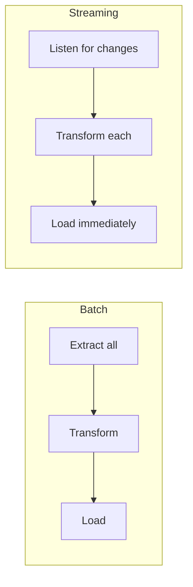
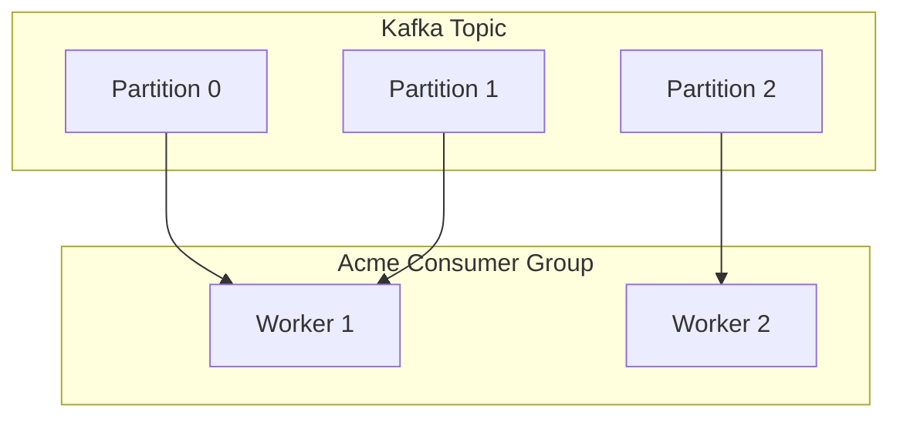

# Real-time Streaming

Acme supports real-time data processing through Change Data Capture (CDC) and message queue connectors. This guide covers setting up streaming pipelines.

## Streaming vs. batch



| Feature    | Batch                | Streaming                    |
| ---------- | -------------------- | ---------------------------- |
| Latency    | Minutes to hours     | Seconds                      |
| Throughput | Higher               | Lower                        |
| Complexity | Lower                | Higher                       |
| Use case   | Analytics, reporting | Real-time dashboards, alerts |

## PostgreSQL CDC

Change Data Capture captures row-level changes (INSERT, UPDATE, DELETE) from the database write-ahead log.

### Prerequisites

1. PostgreSQL 10+ with logical replication enabled:

```sql
-- postgresql.conf
wal_level = logical
max_replication_slots = 4
max_wal_senders = 4
```

2. Create a publication:

```sql
CREATE PUBLICATION acme_pub FOR TABLE users, orders;
```

### Pipeline configuration

```yaml
name: realtime-users
mode: streaming

sources:
  - type: postgres
    name: users_cdc
    connection: ${DATABASE_URL}
    mode: cdc
    publication: acme_pub
    slot: acme_users_slot
    tables:
      - public.users

transforms:
  - type: filter
    condition: "operation IN ('INSERT', 'UPDATE')"
  - type: map
    fields:
      changed_at: "NOW()"

destinations:
  - type: elasticsearch
    index: users
    id_field: id
```

> [!caution] Replication slots
> Unused replication slots prevent PostgreSQL from cleaning up WAL files, which can fill your disk. Always clean up slots when decommissioning a pipeline:
>
> ```sql
> SELECT pg_drop_replication_slot('acme_users_slot');
> ```

## Kafka

### Consumer configuration

```yaml
name: kafka-events
mode: streaming

sources:
  - type: kafka
    name: event_stream
    brokers:
      - kafka1:9092
      - kafka2:9092
      - kafka3:9092
    topic: user-events
    group_id: acme-consumer
    format: json
    start_offset: latest

transforms:
  - type: filter
    condition: "event_type = 'purchase'"

destinations:
  - type: bigquery
    dataset: realtime
    table: purchases
    write_mode: append
    flush_interval: 10s
```

### Consumer group behavior



Acme automatically distributes partitions across workers. Add more workers to increase parallelism.

## Monitoring streaming pipelines

Streaming pipelines run continuously, so monitoring is essential:

```bash
acme status --streaming
```

```
┌────────────────┬──────────┬───────────┬──────────┬───────────┐
│ Pipeline       │ Status   │ Rows/sec  │ Lag      │ Uptime    │
├────────────────┼──────────┼───────────┼──────────┼───────────┤
│ realtime-users │ running  │ 45.2      │ 12ms     │ 3d 14h    │
│ kafka-events   │ running  │ 312.8     │ 2.1s     │ 7d 2h     │
└────────────────┴──────────┴───────────┴──────────┴───────────┘
```

> [!tip]
> Set up alerts for consumer lag using the [[guides/monitoring|Monitoring Guide]]. A growing lag usually indicates your pipeline can't keep up with the data rate.

## Related

- [[concepts/connectors|Connectors]] — streaming connector reference
- [[guides/monitoring|Monitoring]] — dashboards and alerts
- [[guides/error-handling|Error Handling]] — handling failures in streaming pipelines
